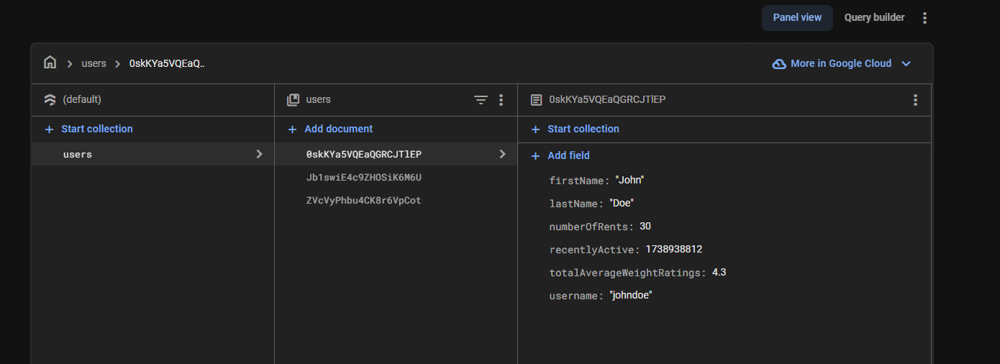

# EBuddy coding test result

### Apps

- `backend`: an [Express](https://expressjs.com/) server
- `frontend`: a [Next.js](https://nextjs.org/) app

## Part 1: Backend Setup

### Assumptions

In the requirement doc, it's mentioned that the framework of choice is Express.js, assuming no Express.js derivative should be used (e.g. NestJS). Thus, sticking to plain Express.js setup.

### Notes

1. The backend uses Firebase admin SDK
2. Backend is not considered as a cloud function backend, rather it's a standalone server that can communicate to firebase

### env vars

Refer to the `.env.sample` file within `apps/backend`, then populate your env vars in `.env` file

### Setup

Refer to part 3 to setup everything at once with turborepo 👇

## Part 2: Frontend setup

### env vars

Refer to the `.env.sample` file within `apps/frontend`, then populate your env vars in `.env` file

### Setup

Refer to part 3 to setup everything at once with turborepo 👇

## Part 3: Monorepo

### Requirements

1. Node.js >= 18 (22 or above is recommended)
2. firebase CLI
3. Java JDK version 11 or higher (for firebase emulator requirement [here](https://firebase.google.com/docs/emulator-suite/install_and_configure#install_the_local_emulator_suite))

### Firestore structure



Sample user docs

```
[
  {
    "firstName": "John",
    "lastName": "Doe",
    "numberOfRents": 30,
    "recentlyActive": 1738938812,
    "totalAverageWeightRatings": 4.3,
    "username": "johndoe"
  },
  {
    "firstName": "Jack",
    "lastName": "Doherty",
    "numberOfRents": 21,
    "recentlyActive": 1734728491,
    "totalAverageWeightRatings": 3.8,
    "username": "jacky"
  },
  {
    "firstName": "Jane",
    "lastName": "Frost",
    "numberOfRents": 30,
    "recentlyActive": 1729285718,
    "totalAverageWeightRatings": 3.3,
    "username": "frostyjane"
  }
]
```

### Setup

**NOTE:** Create an empty folder in the root of the project called `.firebase-emulated-data` so that we can persist our mocked/emulated firebase data locally

```
// install
npm install

// run emulator in terminal, assuming firebase cli is logged in and setup properly
firebase emulators:start --import .firebase-emulated-data --export-on-exit

// run app in a separate terminal process
npm run dev

```

## Part 4: Answers

### Querying most potential users

Assumptions:

1. `totalAverageWeightRatings` can't be negative, with value ranging from 0 - 5

I think since we're using a firestore and we have the data flexibility along with the firebase's cloud function, we should be able to attach some kind of a `compositeScore` for each of the user whenever a user doc is updated (especially for these 3 properties).

on every update of the user doc, we calculate the `compositeScore` and save it in the doc as well. Not too sure on the proper weightage for each of the 3 factors, but maybe like:

```
function calculateCompositeScore(user) {
  const ratingsWeight = 0.6; // contributes to 60% weight
  const rentsWeight = 0.3; // contributes to 30% weight
  const activityWeight = 0.1; // contributes to 10% weight

  // Normalize ratings to a range of 0 to 10
  const normalizedRatings = user.totalAverageWeightRatings * 10;

  // Normalize recentlyActive to a range of 0 to 1
  const maxRecentActivity = 30 * 24 * 60 * 60; // 30 days in seconds
  const now = Math.floor(Date.now() / 1000); // current time in epoch seconds
  const normalizedRecentlyActive = Math.max(0, (maxRecentActivity - (now - user.recentlyActive)) / maxRecentActivity);

  return (normalizedRatings * ratingsWeight) +
         (user.numberOfRents * rentsWeight) +
         (normalizedRecentlyActive * activityWeight);
}
```

Some notes:

- We normalize the ratings (`const normalizedRatings`) first due to its possibility of being a floating value, so that values between 0 and 1 won't lower overall weight of the ratings
- We also normalize recentlyActive (`const normalizedRecentlyActive`) to suppress its value and weight to the lowest amount since it's the final tie-breaker

We can put the above function in a Cloud Function trigger with Firestore's trigger `onDocumentWritten` (or perhaps only on update with `onDocumentUpdated`) to insert/update the new `compositeScore` field into the user's doc.

And then, to query the users, we just need to query based on the new `compositeScore` values from each of the user docs. Pagination would work as usual when using firestore query's pagination now.

### Ensuring recently active field

What I would personally consider to achieve this is by using Firebase's Cloud Function. To further describe my answer, I assume the following:

1. The system has something to do with rents (referring EBuddy portfolio, RentBabe)
2. An `activity` for a user only has something to do with CUD from the CRUD operations available in the platform
3. Within each user object/document, there would be sub-collections that contain any actionable "properties" of the user (e.g. `rooms`, `rentals` collections)
4. Finally, properties updates (rooms, rentals, etc.) can ONLY be actioned/modified by the corresponding user

With these assumptions, we can put a firestore function trigger like the following

```
onDocumentWritten("users/{userId}/rooms/{roomId}", (event) => {
  // 1. get the userId
  // 2. update the user's `recentlyActive` field with a now() timestamp
  // leaving off the implementation details here...
});
```

With this function, we can have the `recentlyActive` field to be always updated by listening to the users' activities on their respective "properties".
This can go in conjunction with the `compositeScore` function above 👆

## Part 5: Answers

1. I think it's when I was given an already built project, which is super messed-up (due to outsourced result) and I need to build new features on it while fixing the 💩 codes inside. The main technical problems are mainly no modularity, no typescript (yes, I prefer typescript) and since it's Vue.js, the reactivity flow is messed up. To go on with the project and fix the problems, I go by each of the business modules, and try to chunk out whatever's business logics that can be plucked out. I favor separation of concerns and try to limit the amount of codes that I see in a single file. After done with the initial cleanup, build the necessary features. Finally when some spare time is available, do tech-chores and settling the tech-debts. Other than that, I think "difficult" is just a matter of a learning process for me and how I can have the time to study and troubleshoot the problems.
2. Personally, I think it depends on what kind of project and how far planned it is. If the plan is already laid out quite extensively and all of the moving parts are clear, I would try to chunk the features by the business logics and build them one by one, mocking the others that are not built yet. In other hand, if the plan is still early and there are unknowns, I would try to break down the project to its MVP state, then iteratively improving it along with building the new features.
3. I always learn faster by actually doing it. Trial and error is my go-to approach. But now, with the addition of an AI sidekick, I can buddy up with it and speeds up the process.
4. Consistency.
5. Unfortunately no.
6. I would say either March/April 2025. I feel like this should be discussed again later on.
